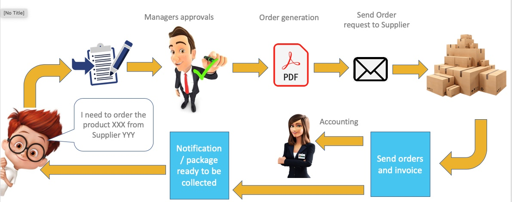

Orders Management System - with Slack (POV)
======================================================================
The purpose of this _mini-Project_ is to Digitize the internal process of the Company XYZ to approve and manage the **Purchase-Order-Requests (POR)**. 
In this Release we will focus on the last part of the process, which aims to notify XYZ-Employees when an order (package) has arrived and to insert some Order-Data.    

Below are the main interactions this integration offers:
* Reception staff, who receive the orders from different Suppliers, enter order data via Slack.  
* The Order Applicant will be notified that the package is ready for collection.
* Admin-users can send a reminder to the order applicant, to collect the package. (Webhook)

Here an example of the **POR**  process:

Project Structure
===============

The project is divided in 2 parts:
1. **Slack app** which can launched with:  `<npm run dev>` or `<node app.js>`
2. **Admin-Orders-Management** area. This is a simulation of the Admin-Area where the admin can send a reminder to Slack using a Webhook.  The sub-project has been stored under the folder **_web_**. It can be launched with
   `<node web/app.js>`

The project does not include a real Database, which has been temporarily replaced by a JSON-file 

Slack Manifest
===============

You can also find in the file _manigest.yml_ the used configuration for the App in [Salck](https://api.slack.com/apps)  
For this project we used the _Socket mode_

Installation
=======
Access the project path: `<cd orders/>`  
Launch the app: `<npm install>`

Future improvements
====================

* Workflow to send reminder (after 3-4 days) for not claimed packages
* Report when an Orders has been fully deliverd (in case of multiple packages, arrived at different times)
* Use of a real DB
* Search of the order status (claimed / not claimed)
* Send a notification message to channel and multiple users
* Delete an order (inserted by mistake)
* Statistics (number of orders per week/month etc.)

